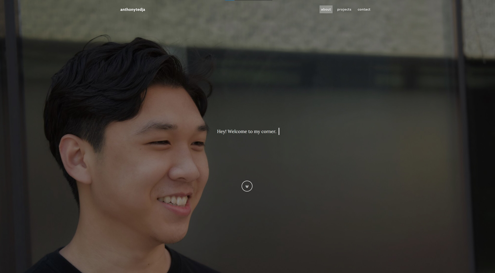

# website

> v1 personal website.

## Features

- Possible Easter Eggs...
- Scroll & Load Animations with [AOS library](https://github.com/michalsnik/aos)
- JS Local Storage saves Theme Settings & Visitor Count
- Google Analytics for Website Traffic Tracking
- Dynamic Favicon matches Theme Settings
- Mouseover for Moving Text Shadow
- Custom Cursor for Cursor & Pointer Events
- Animated Vector Backgrounds
- Custom 404 Page

## Built With

- Bootstrap Studio
- Visual Studio Code
- Codepen
